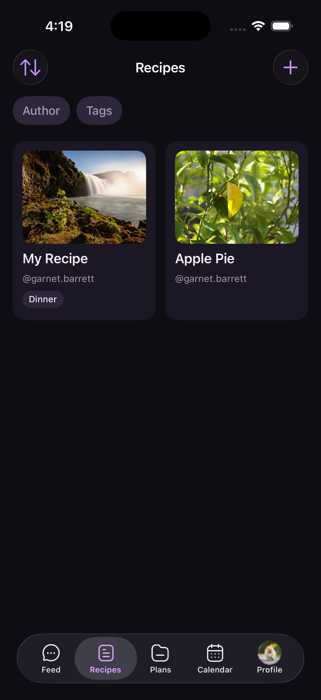
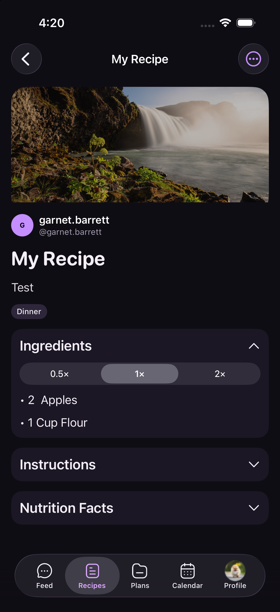
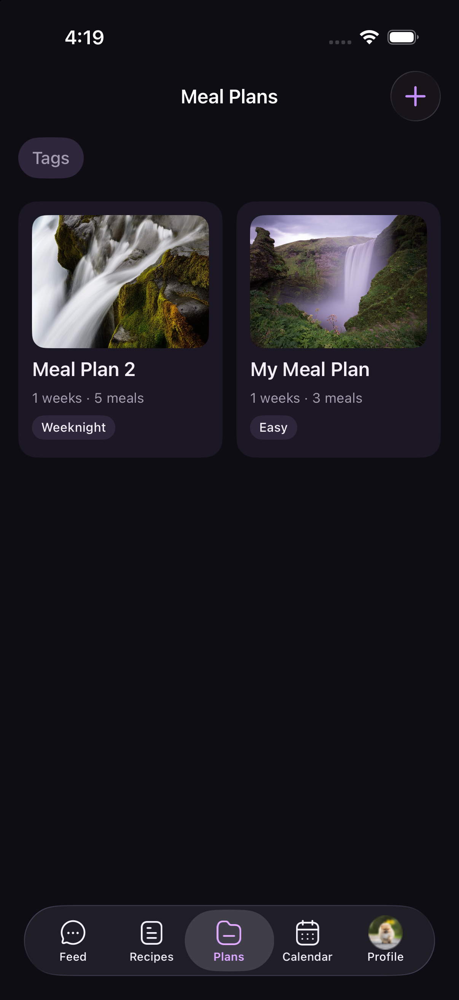
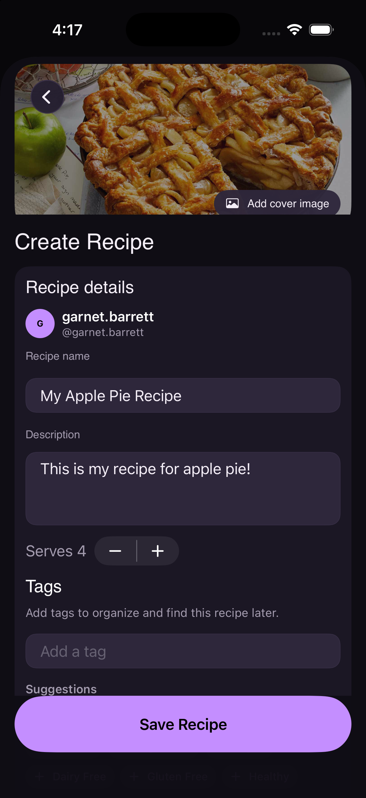
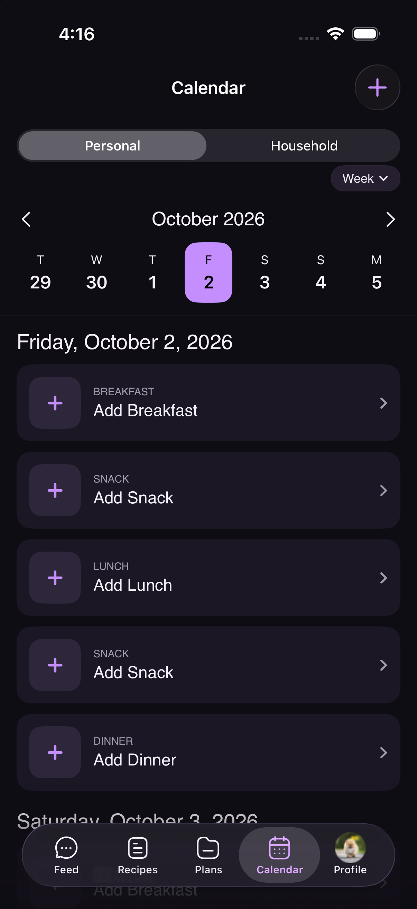

  

<h1 align="center">Taverley</h1>

  Your recipes, your people, and your week, all around one table.

Taverley is a social recipe list and meal planner for iPhone. It brings the whole cooking journey into one place: collecting recipes, planning what to eat, scheduling meals, and sharing inspiration with the people you care about.

## A look inside

<table>
  <tr>
    <th>Recipe collection</th>
    <th>Recipe details</th>
    <th>Meal plans</th>
  </tr>
  <tr>
    <td></td>
    <td></td>
    <td></td>
  </tr>
</table>

<table>
  <tr>
    <th>Create your own recipes</th>
    <th>Plan every meal</th>
  </tr>
  <tr>
    <td width="50%"></td>
    <td width="50%"></td>
  </tr>
</table>

## What you can do

- **Build a recipe collection** — create recipes with photos, ingredients, instructions, nutrition, serving sizes, and tags.
- **Find the right recipe quickly** — search, sort, filter, and save favourites for later.
- **Plan beyond tonight** — create reusable multi-week meal plans and add them to a weekly or monthly calendar.
- **Cook with your household** — invite household members and share editable copies of recipes, plans, and a meal calendar.
- **Discover what others are cooking** — publish posts, attach recipes and photos, follow people, and join the conversation through likes and comments.
- **Choose how you share** — use a public profile or approve followers with a private account.

## Designed around real life

Recipes rarely live in isolation. They become weeknight defaults, family favourites, ideas sent to friends, and plans that change as the week unfolds. Taverley connects those moments without making the experience feel like a spreadsheet.

The app is built natively with SwiftUI and uses Supabase to keep accounts, shared content, and household collaboration in sync.

## Project status

Taverley is currently under active development.
